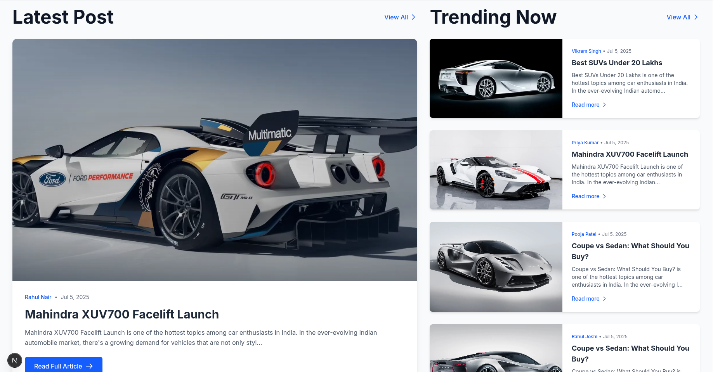
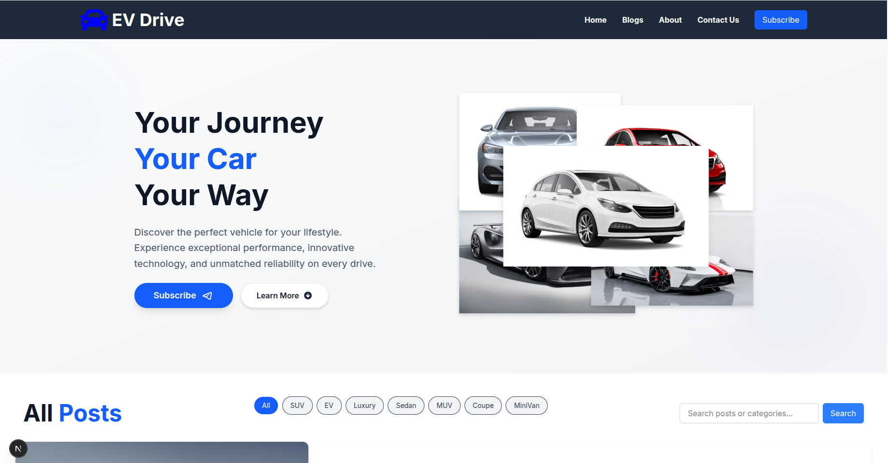
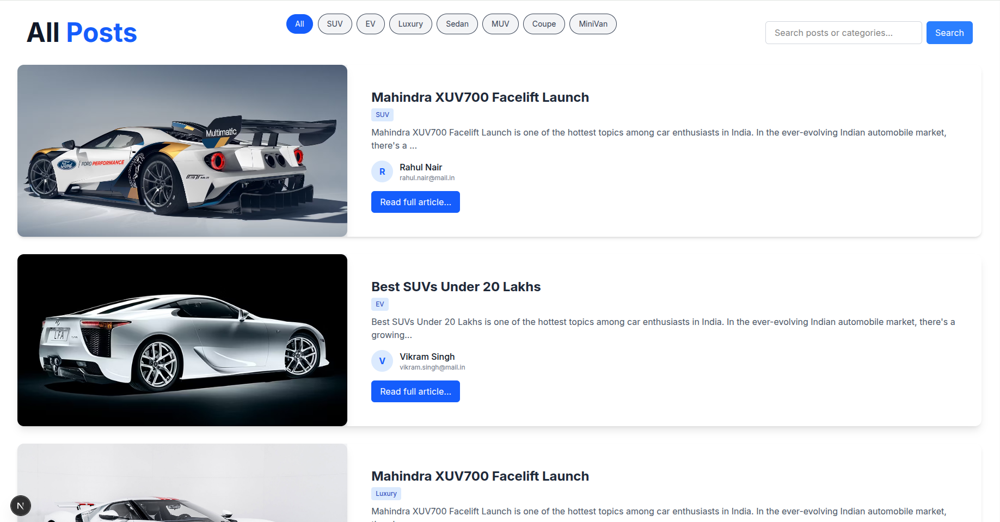
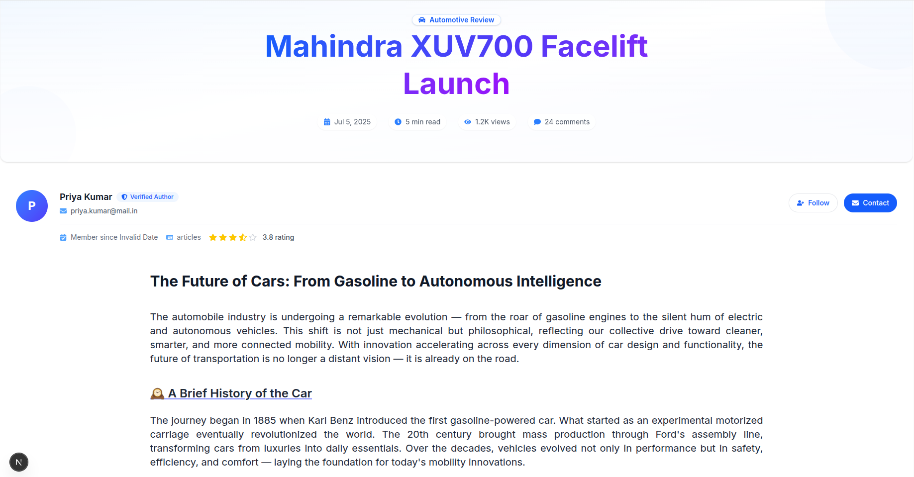
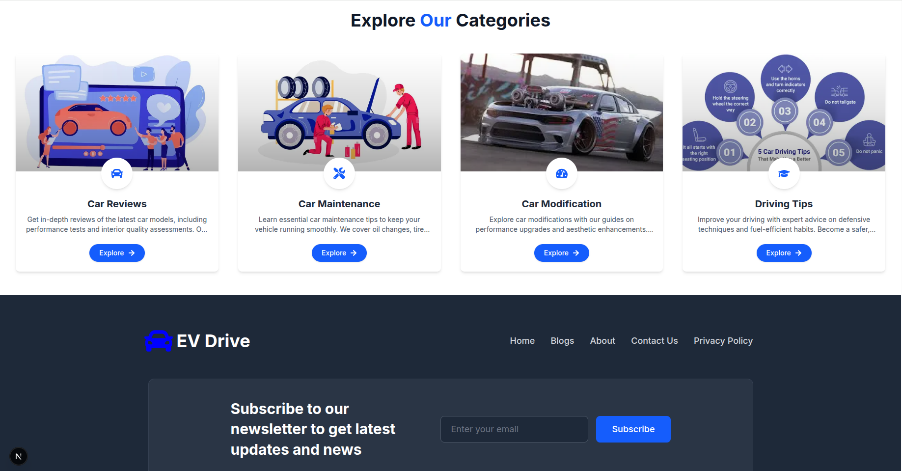

# 🚗 CarBlog - EV Drive

Welcome to **CarBlog**, your ultimate destination for everything on four wheels. Whether you're a seasoned gearhead or a curious commuter, we bring you the **latest news**, **honest reviews**, and **expert tips** to fuel your automotive passion.

---







## 🔍 About CarBlog

In today’s rapidly evolving automotive world, there's a need for a reliable and engaging platform that covers everything from **electric vehicles** to **DIY maintenance**. That’s where **CarBlog** comes in.

Our mission is to:
- Demystify car technology for everyday drivers
- Provide **unbiased car reviews** you can trust
- Help readers make informed purchasing decisions
- Share **hands-on maintenance tips** to keep your car running smoothly
- Cover the exciting global shift towards **electric mobility**

---

## 📰 What We Cover

### 🚘 Vehicle Reviews
- Electric Vehicles (EVs) & hybrids
- SUVs, crossovers, and luxury sedans
- Performance machines & budget-friendly options

### 🛠️ Maintenance & Tips
- DIY repair & seasonal maintenance
- Troubleshooting guides for common issues
- Cost-saving car care strategies

### 🌐 Industry News
- Upcoming car launches and trends
- Automotive technology breakthroughs
- EV battery developments & regulatory news
- Future mobility and smart transportation

### 📦 Buying Guides
- New vs used car comparisons
- Lease vs buy breakdown
- Top picks by category (family, city, off-road, etc.)
- Car negotiation and pricing strategies

---

## 💻 Tech Stack

CarBlog is built with a modern tech stack to ensure performance, scalability, and a great user experience:

- **Next.js** – React framework for SSR & fast performance
- **React** – Building dynamic and interactive UIs
- **TypeScript** – Strongly-typed JavaScript for reliable code
- **Tailwind CSS** – Utility-first CSS for responsive design
- **Vercel** – Lightning-fast hosting & deployment platform

---

## 📱 Responsive Design

CarBlog is fully responsive and optimized for **all device sizes**, from mobile phones to large desktop displays.

---

## 🚀 Getting Started (for Developers)

```bash
# Clone the repo
git clone https://github.com/nitish-k4/carBlog.git

# Navigate to the project
cd carBlog

# Install dependencies
npm install

# Run the development server
npm run dev
# carBlog
# carBlog
# car-blog
